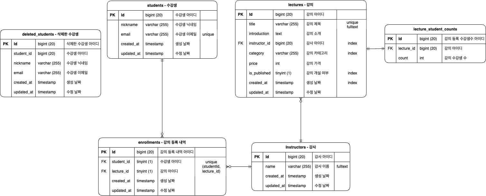
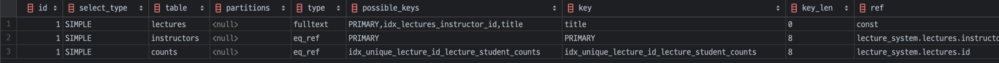

# 강의 시스템 API

## 실행 방법

---

docker-compose.yaml 파일이 위치한 디렉토리에서 다음 명령을 실행

```bash
docker-compose up -d
```

## API 설계

---

- [OpenAPI Specification](docs/api_spec.json)
- [Postman Published API 문서](https://documenter.getpostman.com/view/30873839/2s9YXe7PVA)


## DB 설계

---

### ERD


- 실제 DB에서는 외래키를 걸지않고, 인덱스만 걸었어요.
- 여부 컬럼의 경우 MySQL에서는 native boolean을 지원하지 않기 때문에 **tinyint 타입 컬럼**을 사용했어요.

### 인덱스 구성

1. **students (수강생) 테이블**
    - `email`: 중복방지를 위한 unique 인덱스를 설정해요.
2. **lectures (강의) 테이블**
    - `instructor_id`: 어떤 강사가 강의를 개설했는지 빠르게 찾기위해 인덱스를 설정해요.
    - `title`: 중복방지를 위한 unique, 강의 검색을 위한 fulltext(ngram) 인덱스를 설정해요. 
    - `category`: 강의 카테고리별로 검색하기 위해 자주 사용되므로 인덱스를 설정해요.
    - `is_published`: 공개된 강의만을 필터링하여 조회하기 위해 자주 사용되므로 인덱스를 설정해요.
    - `created_at`: 강의를 최신순으로 조회하기위해 자주 사용되므로 인덱스를 설정해요
3. **instructors (강사) 테이블**
    - `name`: 강의 검색시 검색어로 활용되기에 fulltext 인덱스를 설정해요.
4. **enrollments (수강 내역) 테이블**
    - `student_id`: 어떤 수강생이 어떤 강의를 수강했는지 빠르게 찾기 위해 인덱스를 설정해요.
    - `lecture_id`: 어떤 강의를 어떤 수강생이 수강했는지 빠르게 찾기 위해 인덱스를 설정해요.
    - (`student_id`, `lecture_id`): 강의 중복 수강신청 방지를 위한 unique 인덱스를 설정해요.

## 구현방향 및 고민한점

---

### 코드 아키텍처

typescript에 대한 숙련도가 높지 않기도 하고 현재 프로젝트의 규모가 크지 않기 때문에 복잡성이 낮고, 익숙한 **계층형 아키텍처를 선택**하는 것이 좋겠다고 판단했어요.

계층형 아키텍처의 경우 다음과 같이 구성했어요.

- Controller : 요청 파싱, 응답 구성
- Facade : 서비스 조합, 트랜잭션의 시작점
- Service : 각 도메인에 대한 비즈니스 로직 수행
- Repostiory : DB접근

의존성 : Controller → Facade → Service → Repository

전체 계층의 의존성은 Repository를 향하며, 일정부분의 보일러 플레이트가 생기는것을 감안하더라도 **일관성을 위해 계층을 뛰어넘는 호출이 없도록** 했어요

기존에는 Controller, Service, Repository의 구조로 시작했어요. Service에 비즈니스 로직이 추가될수록 각 Service가 점점 더 많은 도메인의 Repository에 대한 의존성을 가지게
되었고, 각 서비스 메서드들의 역할이 커졌어요.

구조를 개선하고자 Facade Layer를 도입하였고, **Facade Layer에서는 요청에 대해 필요한 도메인별 서비스를 호출**하도록 하게 만들었고, **Service 레이어에서는 해당 도메인과 관련된 비즈니스
로직만 수행**하도록 역할을 분리했어요.

Facade Layer를 도입하면서 코드의 복잡도는 많이 개선되었지만, 아키텍처의 복잡도가 증가하기도 했고, 보일러 플레이트 코드가 일정부분 생성되었다는점 등은 단점이라 생각해요.

### 테스트 전략

테스트 전략으로는 기존에 익숙했던 Mockist 방식을 선택했어요.

각 메서드들을 어떻게 사용할지에 대한 시나리오를 기반으로 인수 테스트를 작성했고, 의존하는 객체들에 대해서는 Mokcing을 통해 테스트를 격리했어요.

매번 Mock객체를 사용할때마다 느끼는것이지만, 테스트가 구현에 강하게 결합되는 경향이 있어서 이러한 결합이 리팩토링의 방해요소가 된다고 생각해요.

### Enrollment 도메인

기존 테이블 스키마 설계는 강사(Instructors), 강의(Lectures), 수강생(Students)를 중심으로, 수강신청의 비즈니스 로직을 처리하기 위해 등록(Enrollments)라는 강의와 수강생의
연결테이블을 만들었어요. 이에따라 애플리케이션을 구현하는 과정에서 연결 테이블에 대한 도메인 객체도 정의하게 되었어요. 

이후 리팩토링 하는 과정에서 연결테이블을 위한 도메인 객체가 나와도 되나에 대한 의문이 생겼어요. 현재의 요구사항 안에서는 Enrollment와 관련한 추가적인 비즈니스 로직이 없기에 복잡도가 높아보이지만
추후에 성적관리와 같은 비즈니스가 추가된다면 해당도메인의 쓰임새가 있을것 같아요.

### 강의당 수강생의 숫자 저장

강의에 등록한 학생수를 조회하는 쿼리가 자주 발생했어요.

강의 등록은 빈번하게 발생하는 요청이고, 그만큼 강의 등록 테이블의 row는 빠르게 쌓이게 될거에요. 이때 count쿼리를 통해 강의당 등록된 학생수를 조회한다면, 성능문제가 발생할것이라 생각했어요. 따라서 별도의 강의당 학생수를 저장하는 테이블을 두고 강의당 등록 학생수를 조회하는 경우 해당 테이블을 조회하도록 구현했어요.

성능은 개선할 수 있겠지만, 학생 탈퇴, 강의 삭제, 수강신청 등 강의당 학생수와 관련된 요청에 대해서 추가적인 구현과 관리가 필요하다는 점은 단점으로 보여요.

추후에는 강의 등록 이벤트가 발생하면, 강의를 저장하고, 강의당 등록된 학생수를 증가시키는 형태의 이벤트 기반 설계로 개선할 수 있을것 같아요.

### 강의 대량등록, 수강신청 - Partial Success vs All or Nothing

두 API모두 여러개의 row를 생성하는 API에요.

요청을 처리하는 과정에서 하나라도 실패하면 모두 롤백할지, 부분성공을 가능하게 할지 여부를 고민했어요

- All or Nothing : 하나라도 실패하면 모두 롤백해요
- Partial Success : 성공, 실패케이스에 대해 각각 응답해요.

**강의 대량등록 API**의 경우 사용자가 직접 모든 정보를 입력해야하는만큼, 부분성공으로 처리하는것이 **더 나은 사용자 경험**을 제공할 것이라 생각해 **Partial Success방식**을 채택했어요

반면 **수강신청 API의 경우** 사용자가 입력해야하는 데이터가 적고, 결제와 관련될 수 있는 API이기에, 부분성공으로 처리하기보단 **데이터 일관성을 위해 All or Nothing 방식**을 채택했어요.

### 트랜잭션 데코레이터

connectionPool에서 connection을 가져와 로직을 수행하고, 에러가 발생하면 롤백하는 로직이 facade레이어 전반에서 반복해서 구현되었어요.

이러한 횡단 관심사를 별도의 트랜잭션 데코레이터를 구현, 분리하여 트랜잭션의 시작점인 facade레이어가 본연의 관심사에 집중할 수 있게끔 개선했어요.

또한 단순 읽기 작업의 경우 readonly 옵션을 적용해 불필요한 트랜잭션 사용으로 인한 오버헤드가 발생하지 않도록 구현했어요.

### 수강생 탈퇴처리 부분

수강생의 경우 사용자와 직접적으로 연결되는 민감한 데이터들을 주로 다루게 될것으로 보여요. 때문에 탈퇴한 수강생이라도 기본적인 정보는 남겨두어야 할 필요성이 있다고 생각했어요. 그래서 다음과 같은 2가지 방식을 생각했어요.

1. 수강생을 DELETE 쿼리를 통해 삭제하지 않고, 탈퇴여부를 표시하는 컬럼을 추가해 기존 테이블에서 관리
2. 별도 탈퇴한 수강생 테이블을 만들어 관리

1번 방법의 경우 탈퇴 여부 컬럼을 추가해야하고, 다른 컬럼들에 unique 제약조건을 거는데 있어서 탈퇴한 수강생과 같이 묶여 제약조건 위반이 발생할 가능성이 존재해요.
예를들어 탈퇴한 수강생중 'test@email.com' 이라는 이메일을 사용하고 있는 수강생이 있고, 새로 회원가입하려는 수강생중 'test@email.com'이라는 이메일을 사용하려고 한다면,
제약조건을 위반하게 되어 회원가입이 불가능해지는 문제가 생겨요.

삭제여부를 deleted_at 타임스탬프 타입으로 두고 이메일과 묶어서 제약조건을 거는 방식도 생각해 보았지만 별도의 테이블을 생성하는것이 로직을 보다 단순화할 수 있어 보였기에 2번 방법을 선택했어요.

추후에 개인정보와 같은 데이터도 함께 입력하게 된다면, 개인정보는 삭제하고 삭제시 남아있어야 하는 필수데이터만 저장하도록 구성할 수 있을것 같아요.

만약 postgresql을 사용한다면 partial index를 통해 is_deleted = false 인 경우에만 unique 제약조건을 걸 수 있어서 1번 방법도 고려해 볼 수 있었을것 같아요.

### 검색시 대소문자 구분

- MySQL에서는 대소문자를 구분하지 않고 조회가 가능해요.
    - 만약 PostgreSQL을 사용한다면 `Like` 대신 `ILike` 를 사용해야 해요.

### 검색시 Like %검색어% 케이스에 대한 성능 개선

기존에는 

```mysql
CREATE INDEX idx_lectures_title ON lectures (title);
```

위와같이 타이틀에 인덱스를 설정해 두었어요.

중간값을 포함한 Like %검색어% 케이스에서 성능저하가 우려가 되어서, 실제 애플리케이션에서 활용될 다음 쿼리를 통해 실행계획을 확인해 보았어요.

```mysql
EXPLAIN
SELECT lectures.id         as id,
       lectures.category   as category,
       lectures.title      as title,
       instructors.name    as instructor_name,
       lectures.price      as price,
       counts.count        as student_count,
       lectures.created_at as created_at
FROM lectures
         JOIN instructors ON lectures.instructor_id = instructors.id
         JOIN lecture_student_counts as counts ON lectures.id = counts.lecture_id
WHERE title Like '%kotlin%';
```

결과로는 인덱스를 활용하지 못하고 있음을 알 수 있었어요. 이를 개선하기 위해 기존 title 풀텍스트 인덱스를 추가하고 쿼리를 변경한후 테스트 했어요.


```mysql
EXPLAIN
SELECT lectures.id         as id,
       lectures.category   as category,
       lectures.title      as title,
       instructors.name    as instructor_name,
       lectures.price      as price,
       counts.count        as student_count,
       lectures.created_at as created_at
FROM lectures
         JOIN instructors ON lectures.instructor_id = instructors.id
         JOIN lecture_student_counts as counts ON lectures.id = counts.lecture_id
WHERE MATCH(title) AGAINST('kotlin');
```

결과는


위와 같이 풀텍스트 인덱스를 사용하고 있음을 확인 할 수 있었고, EXPLAIN ANALYZE 쿼리를 통해 확인한 cost 도 0.72에서 0.33으로 개선되었어요.

하지만 이러한 변경으로 인해 공백으로 명확히 구분되지 않는 단어의 경우 검색이 되지 않는 문제가 발생했어요.

예를들어 '자바스크립트로 알아보는 함수형 프로그래밍' 이라는 강의를 검색하고 싶은 경우 '함수형'으로 검색하면 해당강의를 조회할 수 있었지만,
'함수'로 검색하면 조회되지 않았어요.

이는 Fulltext index 가 공백을 기준으로 토큰화하여 인덱싱 하기 때문에 발생하는 문제인데요, 이를 해결하기 위해 n-gram 알고리즘을 사용해 풀텍스트 인덱스를 구성했어요.

```mysql
ALTER TABLE lectures ADD FULLTEXT INDEX idx_lectures_title (title) WITH PARSER ngram;
```

이후 정상적으로 검색이 되는것을 확인할 수 있었고, 동일하게 강사의 이름을 기준으로 검색하는 경우에도 풀텍스트 인덱스를 사용할 수 있게 변경하여 성능을 개선할 수 있었어요.

최종적으로는 IN BOOLEAN MODE를 사용해 검색어가 포함된 타이틀을 검색할 수 있게 구현했고, 토큰의 최소길이인 ngram_token_size가 2로되어있기에 2글자 이상의 검색만 허용하도록 validation 로직을 추가했어요.

### 강의 대량생성 데드락 이슈

강의 대량생성 요청의 경우 Partial Success 방식을 사용하기로 결정했기에, 각 요청에 대해 별도의 트랜잭션을 사용하고 발생한 예외는 핸들링하여 응답에 포함시키도록 구현했어요.

이때 Promise.all을 사용한 병렬처리를 통해 성능을 개선하고자 했는데, 요청 내부에 중복된 title이 존재하는 경우, title 중복여부를 체크 하는 validation 로직이 phantom read 현상으로 인해 정상적으로 동작하지않아 DB의 unique 제약조건 위반 예외가 그대로 응답에 포함되었어요.

예를들어 다음과 같은 대량생성 요청을 보내는 경우

```json
{
  "items": [
    {
      "title": "Kafka 기초",
      "introduction": "<string>",
      "instructorId": 14,
      "category": "infra",
      "price": 120000
    },
    {
      "title": "Kafka 기초",
      "introduction": "<string>",
      "instructorId": 14,
      "category": "infra",
      "price": 120000
    }
  ]
}
```

기대되는 응답

```json
{
    "items": [
       {
          "id": 39,
          "title": "Kafka 기초",
          "status": 201,
          "message": ""
       },
       {
          "title": "Kafka 기초",
          "status": 400,
          "message": "이미 존재하는 강의 제목(Kafka 기초) 입니다"
       }
    ]
}
```

실제응답


```json
{
    "items": [
        {
            "id": 39,
            "title": "Kafka 기초",
            "status": 201,
            "message": ""
        },
       {
          "title": "Kafka 기초",
          "status": 500,
          "message": "알 수 없는 에러"
       }
    ]
}
```

REPEATABLE READ 격리수준을 사용하는 현재 방식에서는 A 트랜잭션에서 새로운 lecture를 생성하고 커밋하기 이전에 B 트랜잭션에서 title의 중복여부를 위해 조회를 한다면, 
A 트랜잭션의 시작전 데이터를 기준으로 조회하게 되기 때문에 중복된 title을 확인할 수 없어요. 
Pantom Read에 의해 title중복여부 검사를 통과해 중복된 title을 가진 lecture의 insert를 그대로 실행하게 되었고, Duplicated Key로 인한 예외를 사용자가 응답으로 받게 되었어요.

결과적으로 A트랜잭션과 B트랜잭션이 동일한 title의 lecture를 생성하더라도 애플리케이션 레벨에서의 validation이 동작하지 않는것이죠.

이를 해결하기 위해 생각한 방법들은 다음과 같아요.

1. Promise.all 을 제거하고 순차적으로 처리
2. transaction 격리수준을 serializable로 변경
3. Promise.all 을 사용하되 쓰기 잠금 걸기

두번째 방법은 현재 클라이언트 세션의 격리수준을 모두 serializable로 변경해야 하기 때문에, 다른 API의 성능에도 영향을 미칠것이라 생각되어서 사용하지 않았어요.

그렇다면 남은방법은 1번과 3번인데 1번 방식의 경우 정상적으로 실행됨을 확인했기에 3번방법이 보다 나은 성능을 보여줄수 있는지 확인해 보았어요.

쓰기잠금을 위해 생성하려는 강의 title이 이미 있는지 확인하는 쿼리에 FOR UPDATE를 추가해 주었어요.
```mysql
SELECT * FROM lectures WHERE title = ? FOR UPDATE
```
쓰기 잠금을 걸고 해당 API 를 테스트 해보니 데드락이 발생해 다음과 같은 에러가 발생하는 경우가 생겼어요.

```text
Deadlock found when trying to get lock; try restarting transaction
```

이때 데드락 로그를 통해 문제점을 확인해 볼 수 있었어요.

```text
[트랜잭션 1]
*** (1) HOLDS THE LOCK(S):
RECORD LOCKS space id 8 page no 5 n bits 104 index idx_unique_title_lectures of table `lecture_system`.`lectures` trx id 2073 lock_mode X locks gap before rec

*** (1) WAITING FOR THIS LOCK TO BE GRANTED:
RECORD LOCKS space id 8 page no 5 n bits 104 index idx_unique_title_lectures of table `lecture_system`.`lectures` trx id 2073 lock_mode X locks gap before rec insert intention waiting

[트랜잭션 2]
*** (2) HOLDS THE LOCK(S):
RECORD LOCKS space id 8 page no 5 n bits 104 index idx_unique_title_lectures of table `lecture_system`.`lectures` trx id 2072 lock_mode X locks gap before rec

*** (2) WAITING FOR THIS LOCK TO BE GRANTED:
RECORD LOCKS space id 8 page no 5 n bits 104 index idx_unique_title_lectures of table `lecture_system`.`lectures` trx id 2072 lock_mode X locks gap before rec insert intention waiting

```

실제로 존재하지 않는 record에 대해 조회하는 select … for update는 Record Lock이 아닌 Gap Lock을 만들어내요.

이때 삽입시 얻으려고하는 INSERT Intention Gap Lock은 Gap Lock과 호환되지 않기 때문에, 
1번 트랜잭션의 INSERT는 2번 트랜잭션이 가진 Gap Lock을 기다리게 되고, 
2번 트랜잭션의 INSERT는 1번 트랜잭션이 가진 Gap Lock을 기다리게 되어서 Dead Lock 상황이 발생하게 된거에요.

이는 쓰기 잠금을 거는 애플리케이션 레벨의 로직에 락을 구현해 해결할 수 있었어요.

결과적으로는 순차적으로 처리하는 방식(1번)과 병렬처리 + 쓰기잠금 방식(3번)의 성능 차이는 크게 나지 않았지만, 
DB에 저장된 데이터가 많아지면, 병렬처리를 통한 이점이 더욱 커질것이라 생각되어서 3번 방식을 선택했어요.


## 개선할 점

- eslint 적용
- 너무 많이 생성된 test 데이터 생성 팩토리 클래스 정리
- 메서드 명에 따른 로직 일관성 개선
- lock try-catch => 데코레이터로 변경
- RoutConfig 제거 컨트롤러별 데코레이터화, 컴포넌트 스캔 구현 => 관리포인트 줄이기
- 확장성이 떨어지는 계층에 따른 패키지 구조
- 예외처리 handler 메시지 수정
- 응집도 낮은 도메인, 미비된 몇몇 테스트 코드 등등...
